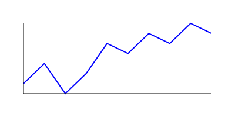

# Enterprise Challenge - Sprint 2 FIAP

This repository contains a sample dataset and script for simulating sensor readings.

## Sensor data

The `data/sensor_data.csv` file is a short run of simulated sensor values.

## Plotting

Run the Python script to generate a line plot:

```bash
python3 scripts/plot_sensor.py
```

The resulting image is saved to `plots/sensor_plot.svg`:



